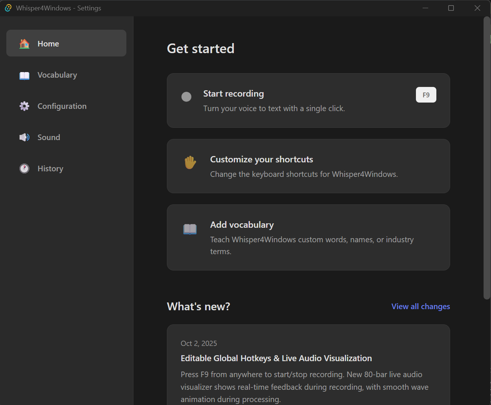

# 🎙️ Whisper4Windows

**Your Voice, Transcribed Instantly - 100% Private, No Internet Required**

Transform your voice into text anywhere on Windows with a simple keyboard shortcut. Whether you're writing emails, taking notes, or coding - Whisper4Windows puts professional speech-to-text at your fingertips, completely free and private.



*Speak naturally, watch your words appear instantly in any application*

---

## Why Whisper4Windows?

### 🔒 **Completely Private**

Your voice never leaves your computer. No cloud, no API keys, no subscriptions. Everything runs locally using OpenAI's powerful Whisper model.

### ⚡ **Lightning Fast**

With GPU acceleration, transcribe 30 seconds of speech in 0.5-2 seconds. No waiting, no buffering - just instant results. CPU fallback available for all systems.

### 🎯 **Works Everywhere**

Press F9 from any app - Word, Chrome, Slack, VSCode - speak your thoughts, and watch text appear exactly where you need it.

### 🌍 **Truly Multilingual**

Supports 99 languages with automatic detection. Switch between languages effortlessly or lock to your preferred ones for better accuracy. Language detection works automatically or you can specify a language for better performance.

---

## 🎬 See It In Action

### **Simple 3-Step Workflow**

1. **Press F9** - Minimal recording window appears at top of your screen
2. **Speak naturally** - Watch the live visualizer respond to your voice
3. **Press F9 again** - Text appears instantly where your cursor is


*Beautiful wave animation shows processing in real-time - all happening locally on your device*

---

## ⚙️ Powerful Settings, Simple Interface

Customize Whisper4Windows to work exactly how you want:


*Fine-tune your keyboard shortcuts, model quality, and processing device*


*Choose your preferred languages, enable GPU acceleration, and control clipboard behavior*


*Select your microphone, adjust sound effects, and customize the experience*

### **Key Settings:**

- **🎯 Model Quality** - Balance speed vs accuracy (tiny, base, small, medium, large-v3)
- **⚙️ Processing Device** - Auto-detect or force GPU/CPU with automatic fallback
- **🌍 Languages** - Auto-detect all 99 languages or specify a language for better performance
- **🎤 Microphone** - Select from all available input devices with device index selection
- **⌨️ Keyboard Shortcuts** - Customize toggle (default: F9) and cancel (default: Escape) shortcuts
- **📋 Clipboard** - Keep text in clipboard or auto-restore previous content
- **🎨 Themes** - Light, dark, or system-matched appearance

---

## 🚀 Getting Started

### **Option 1: MSI Installer (Recommended)**

1. **Download** - Get `Whisper4Windows_0.1.0_x64_en-US.msi` (~660MB)
2. **Install** - Run the installer
3. **Launch** - Start from Start Menu or Desktop
4. **First Run** - Whisper model downloads automatically (~500MB, one-time)
5. **Start Dictating!** - Press F9 anywhere and speak

✅ **CUDA libraries bundled!** GPU acceleration works out-of-the-box if you have an NVIDIA GPU.

### **Option 2: From Source (Developers)**

1. **Clone** - Clone this repo
2. **Run** - Double-click `START_APP.bat`
3. **Wait** - First launch downloads the Whisper model (~500MB, one-time only)
4. **Start Dictating!** - Press F9 anywhere and speak

That's it! No accounts, no configuration wizards, no complicated setup.

### **Try It Now**

Open Notepad (or any text app), press **F9**, and say:

> "Hello world, this is Whisper for Windows transcribing my voice in real-time, completely offline and private."

Watch it appear instantly! ✨

---

## 💪 What You Can Do

- **📝 Write Emails** - Dictate emails 3x faster than typing
- **📄 Take Notes** - Capture meeting notes without looking away
- **💬 Chat Messages** - Respond quickly in Slack, Teams, Discord
- **📚 Write Documents** - Draft reports and documentation hands-free
- **💻 Code Comments** - Dictate code comments and documentation
- **🌐 Browse Faster** - Search Google by voice
- **♿ Accessibility** - Perfect for users who prefer or need voice input

---

## 🔧 System Requirements

**Minimum:**

- Windows 10/11
- 8GB RAM
- Microphone (built-in or external)

**Recommended for GPU Acceleration:**

- NVIDIA GPU (GTX 1060 or better)
- 16GB RAM
- ✅ **No CUDA installation required!** CUDA libraries are bundled with the MSI installer

**Performance:**

- **GPU Mode:** 30 seconds of speech → 0.5-2 seconds transcription ⚡
- **CPU Mode:** 30 seconds of speech → 5-10 seconds transcription
- **Model Sizes:** tiny (fastest) → base → small (recommended) → medium → large-v3 (most accurate)

📖 **[Installation guide →](INSTALLATION.md)** | **[Build your own MSI →](BUILD.md)**

## ❓ FAQ

**Q: Is this really free?**
A: Yes! 100% free and open-source. No subscriptions, no API keys, no hidden costs.

**Q: Do I need an internet connection?**
A: Only for the first-time model download (~500MB). After that, everything works completely offline.

**Q: Do I need to install CUDA for GPU acceleration?**
A: No! The MSI installer includes all necessary CUDA libraries. Just install and it works if you have an NVIDIA GPU.

**Q: Which languages are supported?**
A: All 99 languages that Whisper supports - from Afrikaans to Zulu, including English, Spanish, French, German, Chinese, Japanese, Arabic, and many more.

**Q: How accurate is it?**
A: Very! Using the same AI model that powers many commercial services. Accuracy improves with better quality models (Medium/Large) and GPU acceleration.

**Q: Will this slow down my computer?**
A: No. The app only uses resources when actively recording and transcribing. It sits quietly in the system tray otherwise.

**Q: Can I use it for work?**
A: Absolutely! Perfect for emails, documentation, meeting notes, and more. Since everything is local, it's suitable for confidential work.

---

## 🛠️ Troubleshooting

**Backend not starting?**

```bash
cd backend
venv\Scripts\activate
pip install -r requirements.txt
python main.py
```

**GPU not working?**

- MSI installer: GPU should work automatically - check Device Manager for NVIDIA GPU
- From source: Run `TEST_GPU.bat` to diagnose, see [INSTALLATION.md](INSTALLATION.md)
- App automatically falls back to CPU if GPU fails

**Hotkey not working?**

- Check system tray - app must be running
- Try restarting the app
- Some apps may block global hotkeys

📖 **[Full troubleshooting guide →](INSTALLATION.md#-troubleshooting)**

---

## 📚 Learn More

- **[INSTALLATION.md](INSTALLATION.md)** - Detailed setup guide
- **[BUILD.md](BUILD.md)** - Building MSI installer for distribution
- **[TECHNICAL.md](TECHNICAL.md)** - Technical documentation for developers
- **[DEVELOPMENT_MODE.md](DEVELOPMENT_MODE.md)** - Development workflow guide

---

## 🤝 Contributing

Found a bug? Have a feature request? Contributions are welcome!

1. Fork the repository
2. Create your feature branch
3. Submit a pull request

---

## 📝 License

MIT License - Free to use and modify for personal or commercial use.

---

## ❤️ Acknowledgments

Built with incredible open-source technology:

- **Whisper** by OpenAI
- **faster-whisper** by Systran
- **Tauri** framework
- **FastAPI** framework

Inspired by Superwhisper for Mac.

---

**Ready to transform your workflow? Download Whisper4Windows now and experience the future of voice input on Windows.** 🎤
